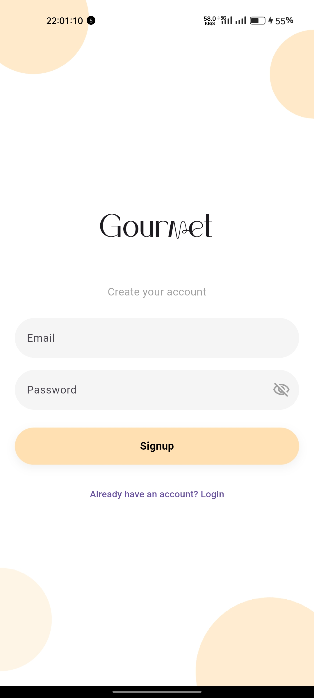
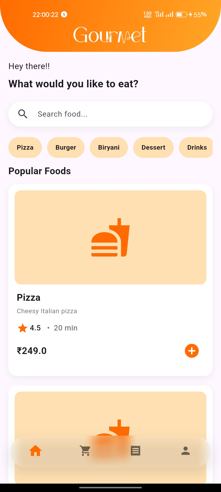
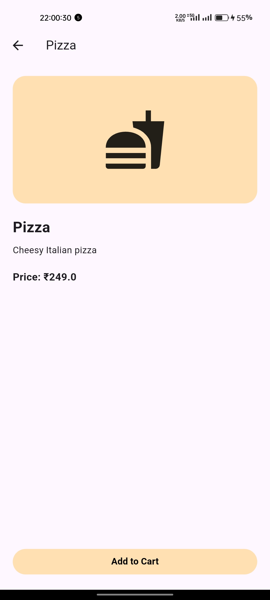
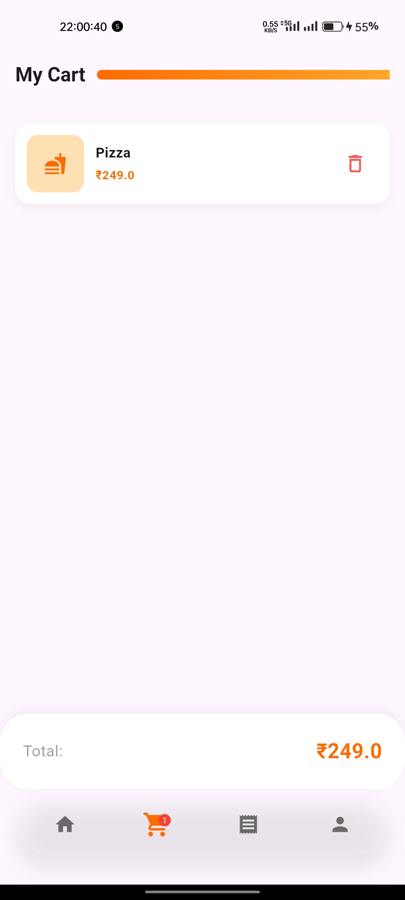
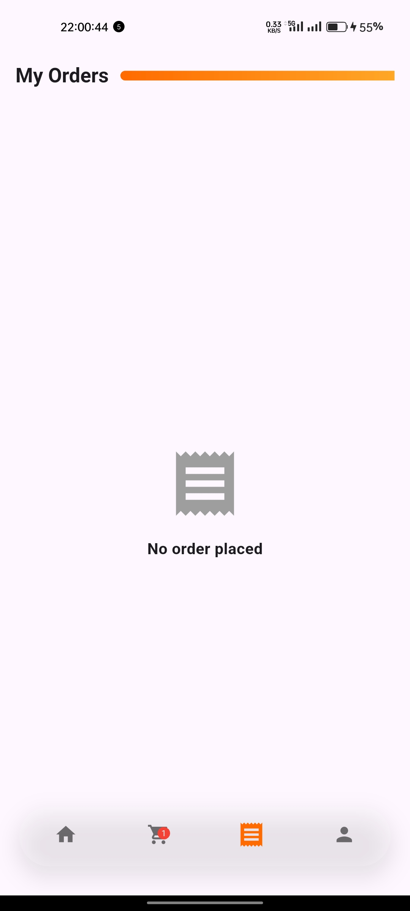
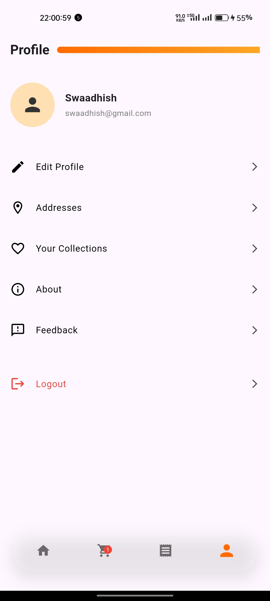

# Gourmet – Food Delivery App (Flutter)

A modern food delivery mobile application built using Flutter with Firebase integration.
Designed to demonstrate clean UI/UX, state management, and real-world app structure.

---

## Features

- Firebase Authentication (Login / Signup / Session handling)
- Food browsing with categories
- Food details screen with Hero animation
- Add to cart & dynamic cart management (Provider)
- Cart badge & total price calculation
- Profile screen with editable user name (Provider)
- Clean modern UI with custom cards & gradients
- Skeleton loading UI (simulated API loading)

---

## Screens

- Login / Signup
- Home (Food listing + categories)
- Food Details
- Cart
- Profile
- Edit Profile

---

## Tech Stack

- **Flutter (Dart)**
- **Firebase Authentication**
- **Provider (State Management)**\
- **Material UI**

---

## 📂 Project Structure

```text
.
├── assets/
│   ├── fonts/
│   └── screenshots/
├── lib/
│   ├── models/
│   │   └── food_model.dart
│   ├── providers/
│   │   ├── cart_provider.dart
│   │   └── user_provider.dart
│   ├── screens/
│   │   ├── auth/
│   │   │   ├── login_screen.dart
│   │   │   └── signup_screen.dart
│   │   ├── cart_screen.dart
│   │   ├── edit_profile_screen.dart
│   │   ├── food_details_screen.dart
│   │   ├── home_screen.dart
│   │   ├── main_screen.dart
│   │   ├── orders_screen.dart
│   │   └── profile_screen.dart
│   ├── themes/
│   │   └── app_colors.dart
│   └── main.dart
├── test/
│   ├── unit_test.dart
│   └── widget_test.dart
└── pubspec.yaml
```

---

## Setup Instructions

1. Clone the repository

```bash
git clone https://github.com/Strange-TQHC/gourmet_app.git
```

2. Navigate to project folder

```bash
cd gourmet
```

3. Install dependencies

```bash
flutter pub get
```

4. Add Firebase config
- Place `google-services.json` inside `android/app/`

5. Run the app

```bash
flutter run
```

---

## Screenshots










---

## Future Improvements

- Food images integration
- Order history with Firebase Firestore
- Address management
- Payment integration
- Dark mode

---

## Author

**KAUSHIK KALYAN BOJJA**
*Flutter Developer*

---

## ⭐ If you like this project

Give it a star ⭐ on GitHub